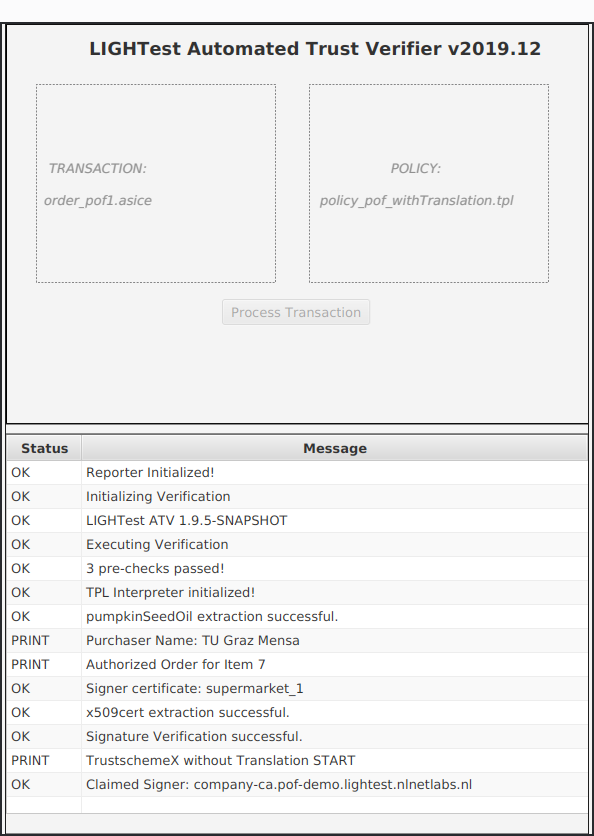

# ATV HowTo

## Quickstart

* Click the jar (it is executable)
* If this does not work, try via terminal:
  `java -jar atv-demo-gui-1.8.1-SNAPSHOT-jfx.jar`
* Select a Transaction (.asic, .asics, or .asice file)
* Select a Policy (.tpl file)
* Click *Process Transaction*
* Wait for the verification to finish
* Read result from Report

## Sample Screenshot

See the [./screenshots](screenshots) folder for more.

